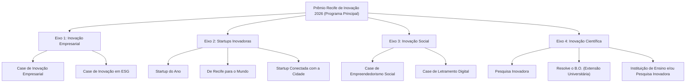

# Mapeamento de Campos: Cadastro do Programa e Formulário no Coreto
## Prêmio Recife de Inovação 2026 (3ª Edição)

> **Documento de Especificação Técnica e Operacional**  
> **Finalidade:** Servir como guia definitivo para o time de gestão cadastrar o **Programa**, suas **Oportunidades Filhas** e o **Formulário de Inscrição** na plataforma **Coreto**, em conformidade integral com o [Edital de Chamamento Público nº XXX/2026](./V0%20EDITAL%20DE%20PR%C3%8AMIO%20INOVA%C3%87%C3%83O%20RECIFE%202026%20%20.md) e a página de submissão implementada em `formspremiorec2026`.

---

## Sumário Executivo

1. [Parte 1: Cadastro do Programa na Plataforma Coreto](#parte-1-cadastro-do-programa-na-plataforma-coreto)
   - [1.1 Informações Básicas](#11-informações-básicas)
   - [1.2 Configuração do Programa e Identidade Visual](#12-configuração-do-programa-e-identidade-visual)
   - [1.3 Links e Anexos](#13-links-e-anexos)
   - [1.4 Datas e Cronograma](#14-datas-e-cronograma)
   - [1.5 Organização Promotora](#15-organização-promotora)
   - [1.6 Áreas e Elegibilidade](#16-áreas-e-elegibilidade)
   - [1.7 Status e Publicação](#17-status-e-publicação)
2. [Parte 2: Estrutura de Oportunidades Filhas (Categorias)](#parte-2-estrutura-de-oportunidades-filhas-categorias)
3. [Parte 3: Mapeamento Detalhado do Formulário de Submissão (Form Builder)](#parte-3-mapeamento-detalhado-do-formulário-de-submissão-form-builder)
   - [Etapa 1: Identificação do Proponente](#etapa-1-identificação-do-proponente)
   - [Etapa 2: Seleção de Eixo e Categoria](#etapa-2-seleção-de-eixo-e-categoria)
   - [Etapa 3: Avaliação Técnica por Critérios do Edital](#etapa-3-avaliação-técnica-por-critérios-do-edital)
   - [Etapa 4: Materiais e Evidências](#etapa-4-materiais-e-evidências)
   - [Etapa 5: Declarações Legais e LGPD](#etapa-5-declarações-legais-e-lgpd)
4. [Parte 4: Checklist Operacional de Implantação](#parte-4-checklist-operacional-de-implantação)

---

## Parte 1: Cadastro do Programa na Plataforma Coreto

Esta seção mapeia exatamente cada tela e campo do formulário administrativo de **Cadastro de Programa** da plataforma Coreto.

### 1.1 Informações Básicas

| Campo no Coreto | Tipo de Campo | Obr. | Valor Sugerido / Configuração | Observações / Justificativa |
| :--- | :--- | :---: | :--- | :--- |
| **Título** | Texto Curto | **Sim** | `Prêmio Recife de Inovação 2026 (3ª Edição)` | Título oficial estabelecido no preâmbulo do edital. |
| **Tipo de Oportunidade** | Seleção Única | **Sim** | `Programa` | Permite agrupar categorias como oportunidades filhas ou abrigar o edital guarda-chuva. |
| **Resumo** | Textarea (Máx 600 caracteres) | **Sim** | *(Ver texto pronto abaixo)* | Texto enxuto, direto e formatado para indexação nas listagens da plataforma. |
| **Descrição Complementar** | Rich Text / HTML / Markdown | Não | *(Ver texto estruturado abaixo)* | Descrição aprofundada com os objetivos da Lei nº 18.974/2022, eixos e critérios. |
| **Tipo de Apoio Oferecido** | Select | **Sim** | `Sem premiação` *(ou "Reconhecimento / Troféu", se disponível)* | Conforme Item 12.1 do edital, a premiação oficial consiste em Troféus de Reconhecimento (sem dotação financeira prevista inicialmente). |
| **Premiação (R$)** | Numérico / Moeda | **Sim** *(se exigido)* | `0,00` | Premiação honorífica/reconhecimento institucional. Caso haja aditivo futuro, atualizar este valor. |

#### Texto Pronto para o campo "Resumo" (568 caracteres):
```text
A Prefeitura do Recife, por meio da Secretaria de Transformação Digital, Ciência e Tecnologia, realiza a 3ª Edição do Prêmio Recife de Inovação 2026 (Lei Municipal nº 18.974/2022). O chamamento reconhece iniciativas inovadoras de empresas, startups, instituições de ensino/pesquisa e organizações sociais que geram impacto real e transformador para a cidade do Recife e seus cidadãos. Concorra em 10 categorias distribuídas em 4 eixos temáticos, além da votação popular transversal via Conecta Recife. Submissões abertas de 30/09 a 25/10/2026.
```

#### Texto Pronto para o campo "Descrição Complementar":
```markdown
### Sobre o Prêmio Recife de Inovação 2026
O **Prêmio Recife de Inovação** é uma realização da Prefeitura do Recife, através da **Secretaria de Transformação Digital, Ciência e Tecnologia (SECTI)**, em conformidade com a Lei Municipal nº 18.974/2022 e diretrizes do Conselho Municipal de Ciência, Tecnologia e Inovação.

#### Objetivos
1. Fomentar a cultura de inovação dentro do ecossistema do Recife;
2. Reconhecer e premiar iniciativas e organizações que desenvolvam soluções inovadoras;
3. Disseminar práticas que sirvam de referência prática para o desenvolvimento socioeconômico da cidade.

#### Eixos de Premiação
- **Inovação Empresarial:** Empresas privadas com foco em soluções de mercado e ESG;
- **Startups Inovadoras:** Startups locais e nacionais conectadas com desafios de Recife;
- **Inovação Social:** Projetos de ONGs, coletivos e letramento digital voltados a comunidades;
- **Inovação Científica:** Pesquisas aplicadas, extensão universitária e instituições de ensino/pesquisa.

#### Critérios de Avaliação (Notas de 1 a 5, Média Aritmética Simples):
1. **Grau de Disrupção:** Originalidade, ruptura frente ao estado da arte e diferenciação;
2. **Resultados:** Evidências qualitativas e quantitativas dos impactos gerados;
3. **Replicabilidade e Potencial de Escala:** Capacidade de expansão e impacto continuado;
4. **Foco nas Pessoas, Território e Ecossistema:** Benefício social ampliado e fortalecimento local.

#### Premiação
Os vencedores receberão o oficial **Troféu de Reconhecimento** na Cerimônia de Premiação (10 categorias técnicas + 4 premiações por Votação Popular no Conecta Recife).
```

---

### 1.2 Configuração do Programa e Identidade Visual

| Campo no Coreto | Tipo de Campo | Obr. | Valor Recomendado | Justificativa |
| :--- | :--- | :---: | :--- | :--- |
| **Slug público do programa** | Texto (URL friendly) | Não | `premio-recife-inovacao-2026` | Identificador canônico e limpo para rotas: `coreto.recife.pe.gov.br/programas/premio-recife-inovacao-2026`. |
| **Cor primária** | Seletor de Cor (HEX) | **Sim** | `#E53935` | Tom vermelho oficial da identidade visual do Prêmio Recife de Inovação. |
| **Cor secundária** | Seletor de Cor (HEX) | **Sim** | `#003B6D` | Tom azul escuro institucional da Prefeitura da Cidade do Recife. |
| **Cor do texto** | Seletor de Cor (HEX) | **Sim** | `#FFFFFF` | Alto contraste e legibilidade sobre os elementos primários. |
| **Banner principal do programa** | Upload de Imagem | Não | Arquivo `banner-premiorec.png` (dimensão: 1600 x 500 px) | Identidade oficial do evento exibida no topo do portal e nos cards de compartilhamento. |

---

### 1.3 Links e Anexos

| Campo no Coreto | Tipo de Campo | Obr. | Valor Recomendado | Observações |
| :--- | :--- | :---: | :--- | :--- |
| **Link Externo** | URL | Não | `https://conecta.recife.pe.gov.br` | Acesso integrado pelo Conecta Recife conforme Item 5.1 do edital. |
| **E-mail da Oportunidade** | E-mail | **Sim** | `premiorecife@recife.pe.gov.br` *(ou contato da SECTI)* | E-mail que receberá notificações automáticas de novas inscrições e suporte a dúvidas. |
| **Arquivos anexos (URLs)** | Textarea (1 URL por linha) | Não | `https://recife.pe.gov.br/diario-oficial/edital-premio-recife-2026.pdf` | Link para download do regulamento completo publicado no Diário Oficial. |

---

### 1.4 Datas e Cronograma

> Conforme Seção 11 do Edital 2026:

| Campo no Coreto | Tipo de Campo | Obr. | Data Oficial | Descrição / Contexto do Edital |
| :--- | :--- | :---: | :--- | :--- |
| **Data de abertura** | Date (dd/mm/aaaa) | **Sim** | `30/09/2026` | Início do período oficial de submissão de projetos na plataforma. |
| **Data Limite (inscrições)** | Date (dd/mm/aaaa) | **Sim** | `25/10/2026` | Último dia para recebimento de inscrições de proponentes. |
| **Data de início prevista** | Date (dd/mm/aaaa) | **Sim** | `26/10/2026` | Início da Análise de Elegibilidade (1ª Avaliação / Banca Interna). |
| **Data de Encerramento** | Date (dd/mm/aaaa) | **Sim** | `15/12/2026` *(estimada)* | Previsão de realização da Cerimônia de Premiação e encerramento do ciclo. |

---

### 1.5 Organização Promotora

| Campo no Coreto | Tipo de Campo | Obr. | Valor Selecionado / Digitado | Detalhes |
| :--- | :--- | :---: | :--- | :--- |
| **Organização vinculada** | Dropdown / Busca | **Sim** | `Secretaria de Transformação Digital, Ciência e Tecnologia` | Selecionar a entidade oficial previamente cadastrada na base de organizações públicas. |
| **Nome da Promotora** | Texto | **Sim** | `Prefeitura da Cidade do Recife - SECTI` | Órgão governamental responsável direto pela execução. |
| **Tipo da Promotora** | Select | **Sim** | `Governo e Setor Público` | Enquadramento governamental municipal. |
| **CEP da oportunidade** | Texto (8 dígitos) | Não | `50030-903` | CEP da Sede da Prefeitura do Recife (Av. Cais do Apolo, 925 - Bairro do Recife). Posiciona a oportunidade no mapa do ecossistema. |
| **Possui parceiros?** | Toggle / Checkbox | Não | **Sim** | Parceiros institucionais: *Conselho Municipal de Ciência, Tecnologia e Inovação (CMCTI)*, *Porto Digital*, *E.I.T.A! Recife*. |

---

### 1.6 Áreas e Elegibilidade

A plataforma Coreto restringe a seleção a **no máximo 3 opções** por categoria:

| Seletor no Coreto | Limite | Opções Marcadas (Recomendadas pelo Edital) | Justificativa Técnica |
| :--- | :---: | :--- | :--- |
| **Áreas Temáticas \*** | Até 3 | 1. `Governo e setor público`<br>2. `Cidades, mobilidade e urbanismo`<br>3. `Tecnologia da informação e comunicação` | Alinhadas às prioridades municipais e aos eixos de inovação urbana da cidade. |
| **Perfis Aceitos \*** | Até 3 | 1. `Organização`<br>2. `Talento`<br>3. `Resolvedor` | Cobre tanto pessoas jurídicas quanto grupos de pesquisa e acadêmicos proponentes. |
| **Tipos elegíveis \*** | Até 3 | 1. `Startup`<br>2. `Empresa estabelecida com projeto de inovação`<br>3. `Grupo de pesquisa` *(ou "OSC/ONG")* | Atende aos 4 eixos principais (empresas, startups, academia e terceiro setor). |
| **Estágios alvo \*** | Até 3 | 1. `Validação (Seed / MVP)`<br>2. `Operação (Early Stage)`<br>3. `Tração (Grow Stage)` | Foco em soluções que já possuem métricas e resultados comprovados. |
| **Nível de TRL preferível \*** | Até 3 | 1. `Prova de conceito em laboratório (TRL 3-4)`<br>2. `Protótipo validado em ambiente relevante (TRL 5-6)`<br>3. `Sistema demonstrado em ambiente real (TRL 7-9)` | Abarca desde pesquisas aplicadas e projetos de extensão até produtos prontos de mercado. |

---

### 1.7 Status e Publicação

- **Status inicial:** `Rascunho (não visível ao público)`
- **Fluxo interno:** `Rascunho`
- **Instrução de salvamento:** Salvar primeiramente como Rascunho para liberar:
  1. A vinculação das **Oportunidades Filhas** (as 10 categorias);
  2. O cadastro e publicação da **Página Institucional** com o formulário embutido.

---

## Parte 2: Estrutura de Oportunidades Filhas (Categorias)

O Prêmio Recife de Inovação 2026 contempla **10 categorias técnicas** distribuídas em **4 eixos fundamentais** (Seção 7 do Edital). Na plataforma Coreto, cada uma deve ser vinculada como Oportunidade Filha sob o Programa:



### Detalhamento das 10 Categorias:

| # | Eixo | Categoria (Oportunidade Filha) | Público-Alvo Específico | Regra Territorial |
| :-: | :--- | :--- | :--- | :--- |
| **01** | Inovação Empresarial | **Case de Inovação Empresarial** | Empresas privadas de qualquer porte | CNPJ ativo no Recife |
| **02** | Inovação Empresarial | **Case de Inovação em ESG** | Empresas privadas com iniciativas ESG | CNPJ ativo no Recife |
| **03** | Startups Inovadoras | **Startup do Ano** | Startups de base tecnológica | CNPJ ativo no Recife |
| **04** | Startups Inovadoras | **De Recife para o Mundo** | Startups com cases internacionais | CNPJ ativo no Recife |
| **05** | Startups Inovadoras | **Startup Conectada com a Cidade** | Startups com impacto urbano local | **Brasil inteiro** (impacto comprovado em Recife) |
| **06** | Inovação Social | **Case de Empreendedorismo Social** | ONGs, OSCs e coletivos | CNPJ ativo no Recife |
| **07** | Inovação Social | **Case de Letramento Digital** | Entidades sociais e empresas de capacitação | CNPJ ativo no Recife |
| **08** | Inovação Científica | **Pesquisa Inovadora** | Universidades, ICTs e pesquisadores | CNPJ ativo no Recife |
| **09** | Inovação Científica | **Resolve o B.O.** | Projetos de extensão universitária | CNPJ ativo no Recife (foco no Banco de Oportunidades) |
| **10** | Inovação Científica | **Instituição de Ensino/Pesquisa Inovadora** | Instituições de ensino técnico ou superior | CNPJ ativo no Recife + credenciamento e-MEC |

---

## Parte 3: Mapeamento Detalhado do Formulário de Submissão (Form Builder)

Este mapeamento espelha os campos implementados no componente `formspremiorec2026/index.tsx` para serem criados no Construtor de Formulários da plataforma Coreto.

### Etapa 1: Identificação do Proponente

| Identificador do Campo | Rótulo no Formulário | Tipo de Entrada | Obrigatório? | Validação / Regras | Exemplo de Preenchimento |
| :--- | :--- | :--- | :---: | :--- | :--- |
| `nomeIniciativa` | **Nome da Iniciativa / Projeto \*** | Texto Curto | **Sim** | Mínimo 3 caracteres | `Recife Conectado: IA no Trânsito` |
| `nomeOrganizacao` | **Nome da Organização / Instituição \*** | Texto Curto | **Sim** | Razão Social ou Nome Fantasia | `Inovare Tecnologias Ltda` |
| `cnpj` | **CNPJ da Organização \*** | Texto com Máscara | **Sim** | Formato `00.000.000/0000-00`. Ativo no Recife (exceto Categoria 05) | `12.345.678/0001-90` |
| `tipoOrganizacao` | **Tipo de Organização \*** | Select / Dropdown | **Sim** | Opções pré-definidas (ver abaixo) | `Startup` |
| `nomeResponsavel` | **Nome do Responsável pela Inscrição \*** | Texto Curto | **Sim** | Nome completo | `Maria Luiza da Silva` |
| `email` | **E-mail para Contato \*** | E-mail | **Sim** | Validação de formato de e-mail | `maria.silva@empresa.com.br` |
| `telefone` | **Telefone / WhatsApp \*** | Telefone com Máscara | **Sim** | Formato `(81) 90000-0000` | `(81) 98765-4321` |
| `municipio` | **Município \*** | Texto Curto | **Sim** | Padrão: `Recife` | `Recife` |
| `uf` | **UF \*** | Select | **Sim** | Padrão: `PE` | `PE` |
| `site` | **Site ou Rede Social Principal** | URL | Não | Formato de URL válido | `https://empresa.com.br` |

#### Opções do campo `tipoOrganizacao`:
- `Empresa Privada`
- `Startup`
- `Instituição de Ensino Técnico`
- `Instituição de Ensino Superior`
- `Instituição de Pesquisa`
- `Instituição de Ciência e Tecnologia (ICT)`
- `Organização Não Governamental (ONG)`
- `Organização Social`
- `Outro`

---

### Etapa 2: Seleção de Eixo e Categoria

| Identificador do Campo | Rótulo no Formulário | Tipo de Entrada | Obrigatório? | Regra de Negócio |
| :--- | :--- | :--- | :---: | :--- |
| `categoriaId` | **Categoria do Prêmio \*** | Radio Button em Cards com Badge de Eixo | **Sim** | Seleção de apenas 1 (uma) categoria por iniciativa (Item 5.5 do edital: mesma proposta não pode concorrer em mais de uma categoria). |

---

### Etapa 3: Avaliação Técnica por Critérios do Edital

> Conforme Seção 9 do Edital 2026, a avaliação técnica é baseada em 4 critérios avaliados com notas de 1 a 5. O formulário coleta as justificativas e respostas descritivas do proponente para cada um dos critérios:

| Identificador | Critério Avaliado | Tipo de Entrada | Obrigatório? | Orientação ao Proponente |
| :--- | :--- | :--- | :---: | :--- |
| `q_disrupcao` | **1. Grau de Disrupção \*** | Textarea (Longo) | **Sim** | Apresente a originalidade da iniciativa e a capacidade de propor soluções inéditas ou melhorias significativas frente ao estado da arte. |
| `q_resultados` | **2. Resultados \*** | Textarea (Longo) | **Sim** | Apresente evidências qualitativas e quantitativas dos impactos alcançados (métricas, dados, indicadores e ganhos concretos). |
| `q_replicabilidade` | **3. Replicabilidade e Potencial de Escala \*** | Textarea (Longo) | **Sim** | Descreva o potencial da solução de ser expandida, adaptada ou reproduzida em novos cenários, territórios e públicos. |
| `q_foco_pessoas` | **4. Foco nas Pessoas, Território e Ecossistema \*** | Textarea (Longo) | **Sim** | Demonstre como a iniciativa coloca as pessoas no centro, gera benefícios sociais e fortalece o ecossistema de inovação do Recife. |

---

### Etapa 4: Materiais e Evidências

| Identificador | Rótulo no Formulário | Tipo de Entrada | Obrigatório? | Regra e Formato |
| :--- | :--- | :--- | :---: | :--- |
| `linkVideo` | **Link do Vídeo Pitch / Demonstração** | URL | Não | YouTube, Vimeo, Google Drive ou Loom (máx. 3 minutos recomendado). |
| `linkApresentacao` | **Link da Apresentação / Pitch Deck (PDF)** | URL | Não | Google Drive, OneDrive, Dropbox ou Canva. |
| `linkAdicional` | **Link para Dossiê, Fotos ou Evidências Adicionais** | URL | Não | Pasta na nuvem contendo reportagens, relatórios técnicos ou fotos. |
| `observacoes` | **Observações Complementares** | Textarea | Não | Campo livre para esclarecimentos adicionais à banca examinadora. |

---

### Etapa 5: Declarações Legais e LGPD

| Identificador | Texto da Declaração no Formulário | Tipo | Obrigatório? | Efeito da Validação |
| :--- | :--- | :---: | :---: | :--- |
| `aceitaTermos` | Declaro que li e concordo integralmente com as regras e condições estabelecidas no **Edital do Prêmio Recife de Inovação 2026**. | Checkbox | **Sim** | Bloqueia envio se desmarcado. |
| `autorizaLGPD` | Autorizo o tratamento dos dados pessoais e o uso de imagem/voz para os fins de gestão e divulgação institucional do Prêmio (Lei nº 13.709/2018). | Checkbox | **Sim** | Bloqueia envio se desmarcado. |
| `iniciativaJaPremiadaAntes` | **A iniciativa já foi premiada em edições anteriores do Prêmio Recife de Inovação?** | Checkbox / Radio | **Sim** | Se marcado como `SIM`: **Bloqueia a submissão** com alerta de inadmissibilidade (Cláusula 4.3 do Edital). |

---

## Parte 4: Checklist Operacional de Implantação

Para o gestor da plataforma Coreto executar antes da abertura oficial:

- [ ] **1. Salvar Programa em Rascunho:** Preencher todos os campos da [Parte 1](#parte-1-cadastro-do-programa-na-plataforma-coreto) e salvar rascunho.
- [ ] **2. Cadastrar as 10 Oportunidades Filhas:** Criar cada uma das categorias listadas na [Parte 2](#parte-2-estrutura-de-oportunidades-filhas-categorias).
- [ ] **3. Configurar Formulário de Inscrição:** Replicar as perguntas e validações da [Parte 3](#parte-3-mapeamento-detalhado-do-formulário-de-submissão-form-builder) no construtor de formulários.
- [ ] **4. Testar Inscrição de Homologação:**
  - Realizar envio de teste em uma categoria regular (validar CNPJ de Recife);
  - Realizar envio de teste na categoria `Startup Conectada com a Cidade` (validar se aceita CNPJ de fora de Recife);
  - Tentar submeter marcando a flag de iniciativa já premiada anteriormente e verificar se o bloqueio funciona.
- [ ] **5. Vincular Banner Oficial:** Realizar upload do banner `1600x500 px` oficial da 3ª edição.
- [ ] **6. Publicação:** Solicitar aprovação administrativa para transição de `Rascunho` para `Publicado` no dia **30/09/2026**.
